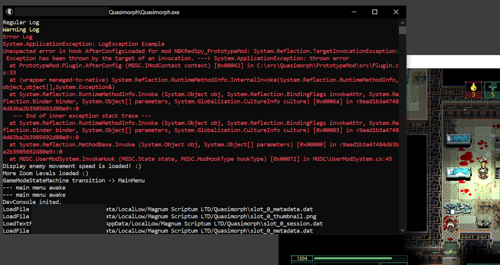

# Unity External Log Window



Outputs the Unity log to an external window.  The output is colored by log type and does not affect the normal logging.

This is similar to BepInEx's console window.

# Usage
Add the code below to add the console to Unity's logging system.

```csharp
    Debug.unityLogger.logHandler = new ColoredLog();
```
# Notes

Closing the console window will close the Unity process.


